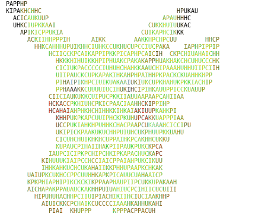

<h1 align="center">
    im2ansi
</h1>
<p align="center" width="100%">
    
</p>

`im2ansi` is a tool for turning images into ANSI art as seen above.

## Installation

Go to [Releases][] and download the appropiate executable or install it via [V][V language]:

```console
v install --git https://github.com/phoenixr-codes/im2ansi
```

## Building

Building requires a [V compiler][V language].

```console
v .
```

## Example Usage

> **Show help**
> ```bash
> im2ansi --help
> ```

> **Genrate an ANSI art from `image.png` of size 30 with seed 123 and character set {P,I,K,A,C,H,U}**
> ```bash
> im2ansi -s 30 --path image.png --seed 123 -c PIKACHU > output.ansi
> ```

> **Generate an ANSI art as SVG from `image.jpg` of size 50 and enable debugging**
> ```bash
> im2ansi --path image.jpg -s 50 --format svg --log DEBUG > output.svg
> ```


[Releases]: https://github.com/phoenixr-codes/im2ansi/releases
[V language]: https://vlang.io/
